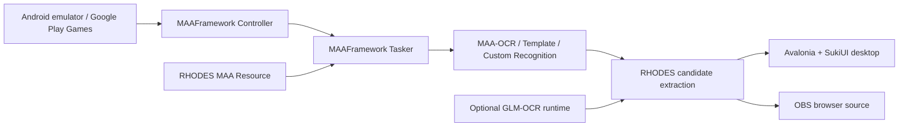

# MAAFramework Family Roadmap

## Goal
RHODES OBS COMMANDER3373 を MAAFramework ファミリーの外部協力を受けやすいツールへ移行する。上流に相談する対象は「Arknights の攻略データ」ではなく、MAAFramework の Controller/Resource/Tasker/Custom Recognition/Action の活用方法に絞る。

基準解像度は 1280x720 とする。これは 16:9 解像度なので、ユーザー提供の基準点切り出しはこの座標系で受け取る。

## Architecture

## Workstreams

### 1. SukiUI Shell
- `apps/rhodes-suki` を主UI候補として育てる
- 設定、ランタイム状態、ADB接続、認識結果レビューを移植する
- Electron/Tauri 版は移行完了まで検証済み実装として残す

### 2. MAAFramework Runtime
- `Maa.Framework` NuGet で C# binding を導入する
- Windows portable ZIP に MAAFramework runtime を含める
- Visual C++ Redistributable が不足する環境向けの診断を用意する

### 3. RHODES MAA Resource
- 基本情報、オペレーター、秘宝、特殊値を MAA Resource の pipeline/task に分割する
- 自前テンプレート検出は MAAFramework task へ移す
- Custom Recognition は RHODES 固有の候補化に必要な最小単位だけ実装する
- `data/recognition/maa-tasks.json` と `data/recognition/scan-profiles.json` を生成元にし、`tools/generate-maa-resource.mjs` で `resource/base/pipeline/rhodes-generated.json` を更新する
- 既存の 1280x720 ROI / template 定義は、旧OCR adapterだけでなく MAA Resource 側にも反映する
- MAA の recognition detail JSON は `maa-resource-results.js` / `maa-resource-scan-runner.js` で既存の RHODES frame/candidate 形式へ変換する

### 4. OCR Strategy
- 既定: MAA-OCR
- 任意: GLM-OCR
- 旧互換: Windows OCR / 単体 PaddleOCR

### 5. Upstream Collaboration
- Issue/Discussion では、再現スクリーンショット、Resource/task JSON、期待結果、実際の結果を添える
- MAAFramework の一般化できる改善は上流へフィードバックする
- RHODES 固有データやOBS表示仕様は本リポジトリ側で管理する

### 6. MFAToolsPlus Usage
- MFAToolsPlus は開発補助ツールとして使う
- 取り込むのは `MaaTasker` セッション、`AppendRecognition` payload、認識結果可視化の考え方に限定する
- 基準点切り出しが必要になった時は、1280x720 の切り出し対象を明示してユーザーへ依頼する

## Current Suki Bridge Status
- 接続済み: `GET /api/health` による RHODES API 状態、`/api/state` からの状態同期、`/api/recognition/scan` による既存ADBスキャン実行。
- 接続済み: `/api/master` による master data 件数診断。Suki ローカルカタログとの差分をランタイム診断に表示する。
- 接続済み: `/api/adb/detect` による MAA 風ADB候補/端末検出、`/api/adb/test` による解像度/スクリーンショット確認。
- 接続済み: `/api/ocr/glm/status`、`/api/ocr/glm/install`、`/api/ocr/glm/uninstall`、`/api/ocr/glm/ollama/*` による任意 GLM-OCR/Ollama 管理。
- 接続済み: `/api/recognition/scan/status` による実行中/直近スキャン進捗確認。
- 接続済み: Suki 側の保存操作から ADB path/serial/preset を `current-state.json` の既存 `adb` スキーマへ同期する。
- 接続済み: Suki 側の保存操作からオペレーター/秘宝の選択、表示列、選択/除外フィルター、overlay scroll speed、Suki出力部品設定、OCR engine を既存 state/preference スキーマへ同期する。
- 接続済み: Suki 側の現在ランIS切替と認識候補適用を API 優先で同期し、API不可時はローカル state へfallbackする。
- 接続済み: Suki の出力画面から Control/Sidecar/Overlay プレビューを既定ブラウザで開く。
- 接続済み: MAAFramework native `Tasker` 結果を既存 recognition scan 形状の証跡JSONとして保存し、候補化後の candidate も同じ証跡へ含める。
- 接続済み: MAAFramework native `Tasker` 実行履歴と Node API 経由スキャン履歴を、UI上の同一スキャン履歴ビューへ統合し、候補/task結果を再読込できる。
- 接続済み: スキャン履歴の `log[]` イベントを詳細パネルへ復元し、capture/recognize/tap等のイベント、スクリーンショットパス、OCR詳細を追える。
- 接続済み: スキャン履歴の `log[].path` がPNG/JPGの場合、読込時に右側プレビューへスクリーンショットを復元する。
- 接続済み: MAA `RecognitionDetailJson` の `filtered_results` / `best_result` / `all_results` をOCR detail行として整形表示する。
- 接続済み: MAA `RecognitionDetailJson` の `roi` / `rect` / `box` をROI detail行として抽出表示する。
- 接続済み: 抽出したROI detail行を1280x720基準のスクリーンショットプレビュー上へ重ね描きする。
- 接続済み: ROI overlayのON/OFFをプレビュー操作から切り替えられる。
- 接続済み: 読み込んだスクリーンショットの実ピクセルサイズを保持し、ROI overlayを1280x720プレビュー座標へ変換する。
- 接続済み: ROI一覧で選択した行だけをプレビュー上で強調表示する。
- 接続済み: OCR detail行の選択から同じentry/sourceのROI overlayを自動選択して強調する。
- 接続済み: Resource task結果とMAA taskログイベント行の選択から同じentryのROI overlayを自動選択して強調する。
- 接続済み: 選択ROIから1280x720基準の編集ドラフトを生成し、`RHODES OBS COMMANDER3373 Debug Logs/ROI Drafts` へJSON書き出しできる。
- 接続済み: ROI編集ドラフトを `data/recognition/maa-tasks.json` の生成元ROIへ対応付け、適用確認、バックアップ付き適用、Suki内Resource再生成まで実行できる。
- 接続済み: Suki内Resource再生成後、MAA接続済みなら `Resource` / `Controller` / `Tasker` を再初期化して生成済みResourceを即時再読込する。
- 接続済み: `RhodesTemplate_*` のROI編集ドラフトを `data/recognition/scan-profiles.json` の `templateOcrRegions[].searchRoi` へ対応付け、バックアップ付きで適用できる。
- 接続済み: ROIドラフト適用後の対象ファイル、target、before/after、backupをUI内で確認できる。
- 接続済み: Suki内Resource再生成後、MAAセッションだけでなくUI側のResourceタスク/プロファイル一覧も再読込する。
- 接続済み: 複数ROIドラフトを `maa-tasks.json` と `scan-profiles.json` の両生成元へ振り分け、全件成功時だけ更新JSONを返すバッチ適用基盤を追加した。
- 接続済み: 表示中のResource ROI候補を一括プレビューし、`maa-tasks.json` / `scan-profiles.json` を各1回バックアップして一括適用できる。
- 接続済み: 一括プレビュー/適用結果のtargetとbefore/afterをUI内の差分一覧で確認できる。
- 接続済み: 表示中のResource ROI候補をチェックリスト化し、一括プレビュー/適用対象をUI上で絞れる。
- 接続済み: 表示中ROI候補チェックリストを全選択/全解除できる。
- 接続済み: 一括ROI候補ごとに未確認/確認済み/適用済み/失敗/対象外の状態と差分詳細を表示できる。
- 接続済み: ROI候補チェック状態、状態ラベル、差分詳細、対象スキャンログ/キャプチャをまとめた調整セッションJSONを保存・読込できる。
- 接続済み: `ROI Sessions` の保存済みセッションを最近順に読み、プロファイル、候補数、対象数、元スキャンログを一覧化できる。
- 接続済み: Suki UIから現在のROI調整セッションを `ROI Sessions` へ保存でき、インスペクタに最終保存先を表示できる。
- 接続済み: Suki UIからROI調整セッション一覧を更新し、保存済みセッションのROI候補、チェック状態、状態ラベル、元スキャン/キャプチャパスを再開できる。
- 接続済み: ROI調整セッション再開時に、元スキャンログの候補、task結果、OCR詳細、ROI overlayも同時復元できる。
- 接続済み: ROI調整セッション再開時に元スキャンログが欠けている場合、UI上で復元不足の原因と同じ画面の再スキャン手順を明示する。
- 接続済み: ROI overlay上の枠を直接クリックして、対象ROIを選択できる。
- 接続済み: 選択中ROIを1px単位で上下左右/幅/高さ調整し、overlayと一括候補へ即時反映できる。
- 接続済み: ROI overlay上の枠を直接ドラッグして位置を移動し、変更候補へ即時反映できる。
- 接続済み: ROI overlay上の左上/右下ハンドルを直接ドラッグして位置・幅・高さをリサイズし、変更候補へ即時反映できる。
- 接続済み: ROI overlay上の左/右/上/下辺ハンドルを直接ドラッグして片側だけをリサイズできる。
- 接続済み: ROI調整ステップを1/4/8pxで切り替え、ボタン調整・ドラッグ移動・リサイズへ同じスナップを適用できる。
- 接続済み: 選択中ROIを元の検出ROIへ戻し、一括候補の状態も未確認へ戻せる。
- 接続済み: ROI overlayのドラッグ/リサイズ中にEscで開始時ROIへ戻し、pointer captureを解除できる。
- 接続済み: ROI調整後に同じResource profileを再スキャンし、before/afterの候補追加・変化・消失を同一画面で比較表示できる。
- 接続済み: ROI調整セッション保存時に再スキャン比較サマリと差分行を紐付け、セッション再開時に復元できる。
- 接続済み: 再スキャン比較のbefore/after task/candidate証跡JSONを保存し、ROI調整セッションへ証跡パスを保持できる。
- 残作業: 再スキャン比較の差分行からbefore/after個別証跡へジャンプできるようにする。

## First Milestone
- SukiUI shell が起動する
- MAAFramework binding assembly を参照できる
- MAAFramework runtime status をUIに表示できる
- MAA ADB の path/serial/config JSON をUIから指定できる
- MAA Controller で接続し、cached screenshot を debug logs に保存できる
- 1280x720 基準の OCR/TemplateMatch probe payload をUIから実行できる
- MAA Resource task をUIから `AppendTask` で実行し、recognition detail JSON を確認できる
- 既存認識定義から MAA pipeline を生成し、publish 前に自動更新できる
- 移行方針がADRとして残っている

## References
- https://github.com/MaaXYZ/MaaFramework
- https://github.com/MaaXYZ/MaaFramework.Binding.CSharp
- https://github.com/kikipoulet/SukiUI
- https://github.com/SweetSmellFox/MFAToolsPlus
